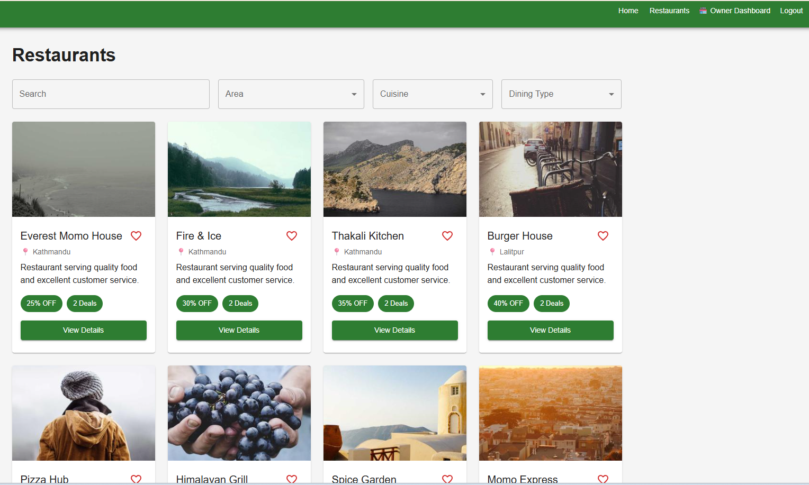
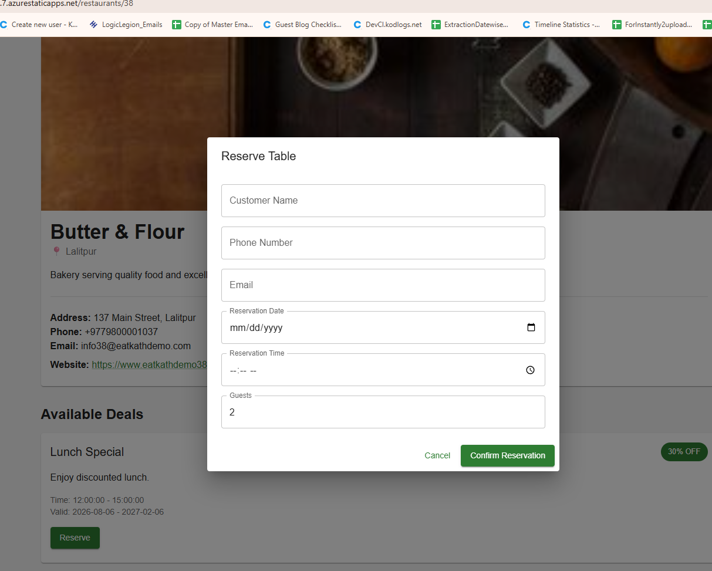
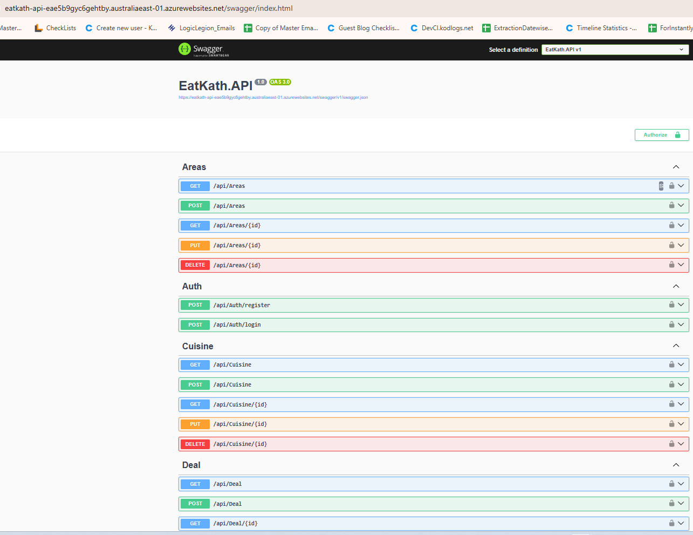
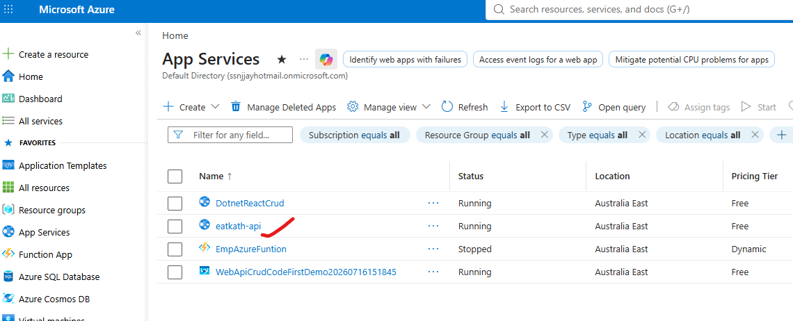
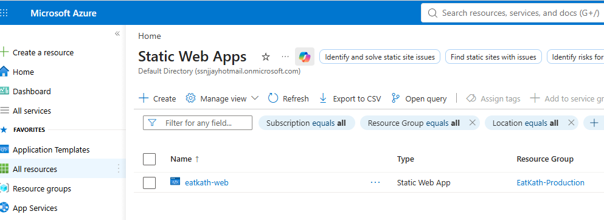

# 🍽️ CraveDine

### Restaurant Discount & Deals Platform

CraveDine is a full-stack restaurant deals platform built with modern
.NET, React, Azure, Docker and CI/CD technologies.

Restaurants can create and manage time-based discounts, while customers
can discover available restaurant deals.

## 🏗️ Architecture

```text
Customer
   ↓
React + TypeScript
   ↓
Axios / HTTPS
   ↓
ASP.NET Core Web API
   ↓
Services → Repositories
   ↓
Entity Framework Core
   ↓
Azure SQL
```


## 🧰 Technology Stack

Frontend: React, TypeScript, Vite, React Router, Hooks, Context API, Axios

Backend: C#, ASP.NET Core Web API, REST APIs, DTOs, Dependency Injection,
Services, Repositories, JWT Authentication, Authorization, FluentValidation

Database: SQL Server, Azure SQL, Entity Framework Core

Testing: MSTest, Moq, FluentAssertions, EF Core InMemory

Cloud & DevOps: Azure App Service, Azure Static Web Apps, Docker,
Azure Container Registry, Azure DevOps Pipelines, GitHub Actions

**Development:** Git, GitHub, GitFlow

**AI-Assisted Development:** Claude Code


Claude Code was used as an AI-assisted development tool throughout the project
for code exploration, architecture analysis, debugging, refactoring,
test development and development workflow assistance.

All generated or suggested changes were reviewed, tested and integrated
by the developer.

## 📁 Project Structure
```text
CraveDine/
├── CraveDine.API/
├── CraveDine.API.Tests/
├── CraveDine.Web/
├── docs/
├── .github/
├── Dockerfile
├── docker-compose.yml
├── azure-pipelines.yml
└── CraveDine.sln
```

## 🔐 Authentication

JWT-based authentication and authorization are used to protect
application functionality and API endpoints.

## 🧪 Testing

The API includes automated tests covering controllers, services
and validators using MSTest, Moq and FluentAssertions.

## 🚀 CI/CD

Frontend
GitHub → GitHub Actions → Build → Azure Static Web Apps

Backend
GitHub → Azure DevOps → Build → Test → Docker → Azure App Service

Azure
Azure Static Web Apps — React frontend
Azure App Service — .NET API
Azure SQL — database
Azure Container Registry — Docker images

## 📌 Project Status

Portfolio MVP — Active Development


## 📸 Application Screenshots

### Customer Application



### API — Swagger


### Azure Deployment



